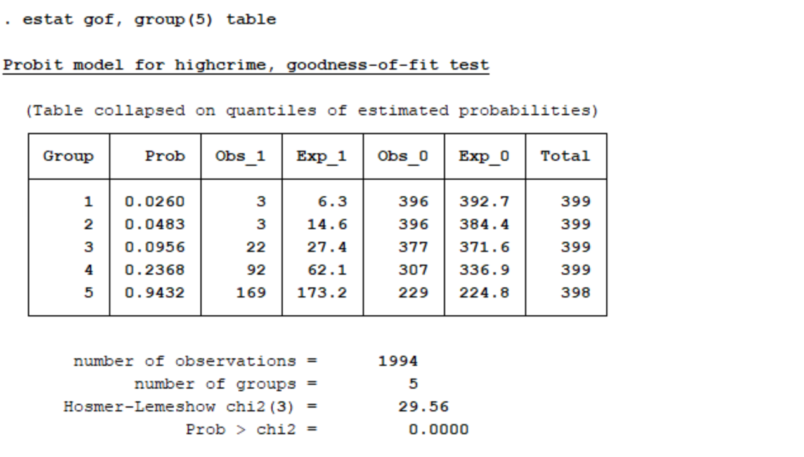

```{r, echo=FALSE,message=FALSE}
library(tidyverse)
```


###Introduction


###Data set

###Python Example

###R Example

###Stata Example

In this example, the models will be evaluated using Pseudo $R^2$, Wald tests, Pearson's test and the Hosmer-Lemeshow test. All three are more easily available in Stata than they are in R or python, so we thought it was worth while to explore all of them briefly below. 

Below is the code to import the data set to Stata. The data loaded is a subset of the original data that only includes the relevant columns. 

```{r, eval=FALSE}
clear
import delimited CommunitiesCrimeData.csv
```

First, we run a probit regression with the data. The syntax for this command is to give the dependent variable followed by any independent variables. If, in and weight options are also avaible, but we didn't use them in this example.

```{r, eval=FALSE}
probit highcrime percapinc pctpopunderpov pcturban population
```


Here is the output for the probit regression. One measure of goodness of fit that can be accessed at this point is Pseudo $R^2$ which is 0.2487 for this model.  Pseudo $R^2$ is used for probit regression because the typical OLS $R^2$ does not apply. This measure should be used cautiously because it is difficult to interpret and does not represent the proportion of the variance explained by the independent variables like the OLS $R^2$.

The coefficients for the probit model can be interpreted as the difference in Z score associated with each one-unit difference in the predictor variable. Three of the four coefficients are significant according to a wald test. The coefficient for per capita income is close to significant but not quite there.

We can access more information on goodness of fit by using a postestimation command that depends on the most recent model.  The command is gof for goodness of fit.

```{r, eval=FALSE}
estat gof
```


This command performs a Pearson's goodness of fit test. The p-value for this test (the Prob > chi2 line) is 1, so we fail to reject the null that the model is a good fit.

We can also perform a Hosmer-Lemeshow test for goodness of fit. The code is very similar to the code for the Pearson test, but we specify the number of groups. Adding table to the command tells Stata to make the table of observation counts for the different groups.

```{r, eval = FALSE}
estat gof, group(5) table
```




Typically, the Hosmer-Lemeshow specifies 10 groups. However, in the case when there are small group counts, it is recommended that we choose a smaller number of groups.
Here we've reduced the number of groups here to 5. Even with the reduced number of groups, the first two groups still have low counts of high crime communities. These low group counts mean that the results of this test are unreliable.

The p-value for this test is > 0.001, which tells us to reject the null hypothesis that the model is a good fit. This contradicts the conclusion we came to with Pearson's test. We showed above that this test may not be reliable, so we should trust the Pearson's test results instead of these results.


Next we run a logistic regression. The syntax for this command is the same as for the probit command. 


```{r, eval=FALSE}
logistic highcrime percapinc pctpopunderpov pcturban population
```


Here is the output for the logistic regression. Again, Pseudo $R^2$ is available. For this model it is 0.2402.  Similar to probit regression, Pseudo $R^2$ is used for probit regression because the typical OLS $R^2$ does not apply.

The coefficients are given as odds ratios. Exponentiating those quantities will give us information on the relationship between the independent variables and the odds of being a highcrime community. According to wald tests for significance, all four independent variables are significant. 

We can access more information on goodness of fit by using a postestimation command that depends on the most recent model.

```{r, eval=FALSE}
estat gof
```


This command performs a Pearson's goodness of fit test. The p-value for this test (the Prob > chi2 line) is 1, so we fail to reject the null that the model is a good fit. 

We can also perform a Hosmer-Lemeshow test for goodness of fit. 

```{r, eval = FALSE}
estat gof, group(5) table
```


Similarly to the probit case, we've reduced the number of groups here to 5. Even with the reduced number of groups, the first two groups still have low counts of high crime communities. The low group counts mean that the results of this test are unreliable.

The p-value for this test is > 0.001, which tells us to reject the null hypothesis that the model is a good fit. However, this contradicts the conclusion we came to with Pearson's test, and because we established that this test may not be reliable, we should trust the Pearson's test results. 


Overall, the logistic and probit models perform similarly. The psuedo $R^2$ is slightly higher for the probit model in this situation. Three of the four predictors are significant in the probit model, while all four are significant in the logistic model. This difference my lead to slightly different final models if we were using these models as intermediate steps in our model building process.
Both models have good fit according the Pearson's goodness of fit test. Both models were poor fitting according to the Hosmer-Lemeshow test, but this test is likely to be unreliable due to low group counts. The major difference is the link function and not performance.


###Conclusion

In all three examples, you can see that logistic and probit regression performed similarly. Running the models and doing the diagnostic tests was relatively easy and short in both Stata and R. However, it was inconvient in python because sklearn package doesn't include functions for the tests. It is necessary to code the tests from scratch. This may influence your language choice if you are running similar analysis.

Your choice of link function may depend on the audience you will present to. Logistic models are common in biological and epidemiological settings because odds ratios are common in those settings. Probit models more often arise in econometric or political science settings. 

###References

Stata logistic documentation: https://www.stata.com/manuals13/rlogistic.pdf    
UCLA Stata logistic regression: https://stats.idre.ucla.edu/stata/output/logistic-regression-analysis/    
Stata estat gof documentation: https://www.stata.com/manuals13/restatgof.pdf     
Stata probit documentation: https://www.stata.com/manuals13/rprobit.pdf   
UCLA Stata probit regression: https://stats.idre.ucla.edu/stata/dae/probit-regression/    
The Analysis Factor: https://www.theanalysisfactor.com/the-difference-between-logistic-and-probit-regression/     
