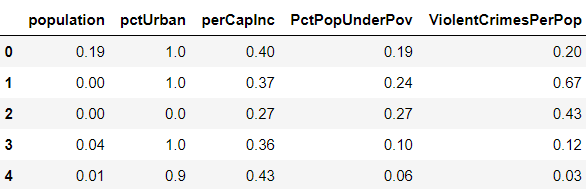
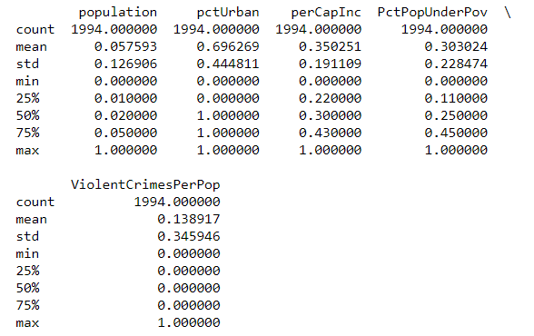

The purpose of our group is to compare the performance between Probit Regression and Logistic Regression in 'Communities and Crime' Data Set with Stata, R and Python. 

<font size="5">Introduction to Probit Regression and Logistic Regression</font><br /> 

The logit model and probit model can both be used to do nonlinear estimation on dichotomous or binary dependent variables. In this tutorial, we will mainly focus on data with binary outcome. In this case the logit model and the logistic model can be used as the same model. These two models both share the same basic idea of applying a link function to binary dependent variables to transform it to continuous variables on the set of real numbers. After the transformation, the commonly used linear regression can be applied to the new data with the original independent variables and transformed dependent variables. The main difference between logit model and probit model is the link function they used. The probit model used the cumulative distribution function (CDF) of standard normal distribution to define link function while the logit model used the CDF of logistic model. The logit function is very similar to standard normal distribution function while the normal distribution function has heavier tail than logit function does.


<font size="5">Description of Data</font><br /> 

The dataset we used is 'Communities and Crime' Data Set from UCI Machine Learning Repository. The data combines socio-economic data from the 1990 US Census, law enforcement data from the 1990 US LEMAS survey, and crime data from the 1995 FBI UCR.

We chose ViolentCrimesPerPop as response variable and Population, perCapInc, PctPopUnderPov, pctUrban as predictor variables.However, ViolentCrimesPerPop is a continuous variable while both logit and probit regression require a binary outcome. We made our response binary by classifying observations of 0.5 or higher as high crime communities and observations of less than 0.5 as low crime communities. We chose 0.5 as the cut off because it corresponds to 1 violent crime for every 200,000 people in the community. Our task is to figure out what is more likely to cause high violent crime rate based on their personal information. The probit and logistic regression are carried out to handle this challenge.


```{r, echo=FALSE,message=FALSE}
library(aod)
library(ggplot2)
library(dplyr)
library(ResourceSelection)
library(tidyverse)
```


<font size="5"> Python Part</font><br />

<font size="4"> 1) Import libraries needed</font><br />

```{r, eval=FALSE}
import numpy as np
import pandas as pd
from sklearn.linear_model import LogisticRegression
import pysal
from scipy.stats import chi2, norm
```


<font size="4"> 2) Load and clean the data</font><br />

Before implementing the models, we first load the data in our working directory. Having noticed that this dataset used '?' as missing values, we repalce it with np.nan so that the missing values can be figured out by Python. And then we select the independent variables we need which are 'population' (col6), 'pctUrban' (col17), 'perCapInc' (col26), 'PctPopUnderPov' (col34) and dependent variable 'ViolentCrimesPerPop' (col128). And then we drop all the lines that include missing values. And the top 5 lines of the dataset are shown below.

```{r, eval=FALSE}
with open('communities.data','rb') as f:
        file_content = list(item.decode() for item in f)
        
raw_data = []
for item in file_content:
    item_rp = item.rstrip('\r\n')
    item_sp = item_rp.split(',')
    raw_data.append(item_sp)

col_names = range(128)
f = pd.read_csv('communities.data', header = None)
raw_data = f.replace('?', np.nan)

mydata = raw_data.iloc[:,[6-1, 17-1, 26-1, 34-1, 128-1]]
mydata.columns = ['population', 'pctUrban', 
                  'perCapInc', 'PctPopUnderPov',
                  'ViolentCrimesPerPop']
data = mydata.dropna()
data.head()
```




<font size="4"> 3) Recode the data</font><br />
As this tutorial mainly focus on the binary outcome variable, we create a cut-off point for the dependent variable to transform it from continuous to binary. We set the value of *ViolentCrimesPerPop* (total number of violent crimes per 100K popuation) to be 1 when it is larger than 0.5 and to be 0 when it is smaller than 0.5. The following table is the summary of the recoded data. We can see that the data is standardized --- the range of each variables are [0, 1].

```{r, eval=FALSE}
data['ViolentCrimesPerPop'][ data['ViolentCrimesPerPop'] > 0.5 ] = 1
data['ViolentCrimesPerPop'][ data['ViolentCrimesPerPop'] <= 0.5 ] = 0
print(data.describe())

X = data.iloc[:,:4].values
Y = data.iloc[:, 4].values[:, None]
```




<font size="4"> 4) Define some functions for future models</font><br />

<font size="3"> 1) Function for HL-test</font><br />

We will apply Hosmer-Lemeshow test to compare the goodness of fit in probit and logit model. However, Python doesn't have any package for this test, So, we define the HL test function based on its concept and output the chi-squared statistic and p-value for it.

```{r, eval=FALSE}
def hl_test(data, g):
    '''
    Hosmer-Lemeshow test to judge the goodness of fit for binary data

    Input: dataframe(data), integer(num of subgroups divided)
    
    Output: float
    '''
    data_st = data.sort_values('prob')
    data_st['dcl'] = pd.qcut(data_st['prob'], g)
    
    ys = data_st['ViolentCrimesPerPop'].groupby(data_st.dcl).sum()
    yt = data_st['ViolentCrimesPerPop'].groupby(data_st.dcl).count()
    yn = yt - ys
    
    yps = data_st['prob'].groupby(data_st.dcl).sum()
    ypt = data_st['prob'].groupby(data_st.dcl).count()
    ypn = ypt - yps
    
    hltest = ( ((ys - yps)**2 / yps) + ((yn - ypn)**2 / ypn) ).sum()
    pval = 1 - chi2.cdf(hltest, g-2)
    
    df = g-2
    
    print('\n HL-chi2({}): {}, p-value: {}\n'.format(df, hltest, pval))
```

<font size="3"> 2) Function for p-values</font><br />

Due to the lack of the function for outputting the significance of each variables in sklearn logistic packages, we write a function to print out p-values for each independent variables in logistic model in sklearn package.

```{r, eval=FALSE}
def logit_p(skm, x):
    '''
     Print the p-value for sklearn logit model

    Input: model, nparray(df of independent variables)
    
    Output: none
    '''
    pb = skm.predict_proba(x)
    n = len(pb)
    m = len(skm.coef_[0]) + 1
    coefs = np.concatenate([skm.intercept_, skm.coef_[0]])
    x_full = np.matrix(np.insert(np.array(x), 0, 1, axis = 1))
    result = np.zeros((m, m))
    for i in range(n):
        result = result + np.dot(np.transpose(x_full[i, :]), 
                                 x_full[i, :]) * pb[i,1] * pb[i, 0]
    vcov = np.linalg.inv(np.matrix(result))
    se = np.sqrt(np.diag(vcov))
    t =  coefs/se  
    pval = (1 - norm.cdf(abs(t))) * 2
    print(pd.DataFrame(pval, 
                       index=['intercept','population','pctUrban', 
                              'perCapInc', 'PctPopUnderPov'], 
                       columns=['p-value']))
```


<font size="4"> 5) Fit the model</font><br />

Now we can fit our different models for the manipulated dataset and apply the HL test.

<font size="3"> 1) Probit model</font><br />

```{r, eval=FALSE}
pbt = pysal.spreg.Probit(Y, X, 
                         name_x=['population', 'pctUrban', 
                                 'perCapInc', 'PctPopUnderPov'], 
                         name_y='ViolentCrimesPerPop', 
                         name_ds='Coummunities and Crime')
data['prob'] = pbt.predy
print(pbt.summary)
p_probit = hl_test(data, 5)
```


From the summary of the probit model above, we can see that *perCapInc* variable is insignificant, while other 3 variables are significant. According to the meaning of these varibales, the population for community, percentage of people living in areas and the percentage of people under the poverty level do have enough influence on the crime rate in communities, while the income of people doesn't have significant influence on the crime rate. And according to the HL test, we can see that the p-value is very close to 0, so we have to reject the null hypthesis. Thus, the probit model didn't fit the data well.

<font size="3"> 2) Logit model</font><br />

```{r, eval=FALSE}
lr = LogisticRegression(C=100.0, random_state=0)
lr.fit(X, Y)
data['prob'] = lr.predict_proba(X)[:, 1]
print(logit_p(lr, X))
p_logit = hl_test(data, 5)
```


From the summary of logit model, we can also see that except variable *perCapInc*, other 3 variables are significant. And from the figure above, we can see that the p-value of the HL test in logit model is also very close to 0. So, we have to reject the null hypothesis and concludes that it is a poor fit. Compared the result of HL test in logit model with that of the probit model, we can see that there is slight difference. Thus, the logit model and probit model both didn't fit the dataset well.


<font size="5"> R Part</font><br />

<font size="4"> 1) Loading data</font><br />

We selected the "Population, perCapInc, PctPopUnderPov, pctUrban" as predictor variables and deleted the missing value.

```{r}
communities.data <- read.csv("~/Stats506GroupProject/communities.data.txt", header=FALSE)
df3<-select(communities.data,c(6,17,26,34,128))
df3<-na.omit(df3)
a=rep(0,1994)
for(i in 1:1994){
  if(df3$V128[i]>0.5){
    a[i]=1
  }
}
df3<-cbind(df3,a)
head(df3)
```

<font size="4"> 2) Probit model</font><br />

The code below estimates a probit regression model using the glm (generalized linear model) function.

```{r}
myprobit <- glm(a ~ V6 + V17 + V26 +V34, family = binomial(link = "probit"), data = df3)
summary(myprobit)
```

The deviance residuals are a measure of model fit. This part of output shows the distribution of the deviance residuals for individual cases used in the model. The next part of the output shows the coefficients, their standard errors, the z-statistic and the associated p-values.

From the result we can see that "Population, PctPopUnderPov, pctUrban" are statistically significant while "perCapInc" doesn't have good performance. 

Below the table of coefficients are fit indices, including the null and deviance residuals and the AIC. Later we show an example of how you can use these values to help assess model fit. In addition, we can obtain confidence intervals for the coefficient estimates that is based on the standard error and the normal assumption.

```{r}
confint(myprobit)
```

We can test for an overall effect of "Population, PctPopUnderPov, pctUrban, perCapInc" using the wald.test function.

```{r}
wald.test(b = coef(myprobit), Sigma = vcov(myprobit), Terms = 2:5)
```

The chi-squared test statistic of 322.7 with 4 degrees of freedom is associated with a p-value of less than 0.001 indicating that the overall effect of rank is statistically significant. Then we use testing data set and predicted probabilities to help us understand the model. 

```{r}
df3[, c("p", "se")] <- predict(myprobit, df3, type = "response", se.fit = TRUE)[-3]
with(myprobit, pchisq(null.deviance - deviance, df.null - df.residual, lower.tail = FALSE))
```

We can also see measures of how well our model fits. The chi-square of 305.8052 with 3 degrees of freedom and an associated p-value of less than 0.001 tells us that our model as a whole fits significantly better than an empty model.

Then we took the Hosmer-Lemeshow test to compare the result of probit model with logistic model. 

```{r}
hoslem.test(myprobit$y, fitted(myprobit), g=5)
```

The group number is set as 5 because this will be easy to compare the results with other language. The p-value is 1.41e-06 which is very close to zero. This means we have reject the null hypothesis for the HL test that the model has a good fit. 

<font size="4"> 3) Logistic model</font><br />

Just like the probit regression, the code below estimates a probit regression model using the glm (generalized linear model) function.

```{r}
mylogit <- glm(a ~ V6 + V17 + V26 +V34, data = df3, family = "binomial")
summary(mylogit)
confint.default(mylogit)
```

We can see that Logistic model has similar result as the Probit model. All the predictors are statistically significant except for perCapInc. (The p-value for perCapInc in Logistic model is lower than in Probit model)

```{r}
wald.test(b = coef(mylogit), Sigma = vcov(mylogit), Terms = 2:5)
```

The chi-squared test statistic of 285.1 ( a little bit lower than the one in probit regression) with 4 degrees of freedom is associated with a p-value of less than 0.001 indicating that the overall effect of rank is statistically significant. 

```{r}
 hoslem.test(mylogit$y, fitted(mylogit), g=5)
```

From the H-L test in Logistic model, we can see that the p-value is 4.263e-06 which is similar with the result in Probit model. Therefore we can get the conclusion that both probit model and logistic model fit poorly.  


<font size="5"> STATA Part</font><br />

In this example, the models will be evaluated using Pseudo $R^2$, Wald tests, Pearson's test and the Hosmer-Lemeshow test. All of these diagnostic tests or values are more easily available in Stata than they are in R or python, so we thought it was worth while to explore all of them briefly below. 

Below is the code to import the data set to Stata. The data loaded is a subset of the original data that only includes the relevant columns. 

```{r, eval=FALSE}
clear
import delimited CommunitiesCrimeData.csv
```

First, we run a probit regression with the data. The syntax for this command is to give the dependent variable followed by any independent variables. If, in and weight options are also avaible, but we didn't use them in this example.

```{r, eval=FALSE}
probit highcrime percapinc pctpopunderpov pcturban population
```


Here is the output for the probit regression. One measure of goodness of fit that can be accessed at this point is Pseudo $R^2$ which is 0.2487 for this model.  Pseudo $R^2$ is used for probit regression because the typical OLS $R^2$ does not apply. This measure should be used cautiously because it is difficult to interpret and does not represent the proportion of the variance explained by the independent variables like the OLS $R^2$.

The coefficients for the probit model can be interpreted as the difference in Z score associated with each one-unit difference in the predictor variable. Three of the four coefficients are significant according to a wald test. The coefficient for per capita income is close to significant but not quite there.

We can access more information on goodness of fit by using a postestimation command that depends on the most recent model.  The command is gof for goodness of fit.

```{r, eval=FALSE}
estat gof
```


This command performs a Pearson's goodness of fit test. The p-value for this test (the Prob > chi2 line) is 1, so we fail to reject the null that the model is a good fit.

We can also perform a Hosmer-Lemeshow test for goodness of fit. The code is very similar to the code for the Pearson test, but we specify the number of groups. Adding table to the command tells Stata to make the table of observation counts for the different groups.

```{r, eval = FALSE}
estat gof, group(5) table
```


Typically, the Hosmer-Lemeshow specifies 10 groups. However, in the case when there are small group counts, it is recommended that we choose a smaller number of groups.
Here we've reduced the number of groups here to 5. Even with the reduced number of groups, the first two groups still have low counts of high crime communities. These low group counts mean that the results of this test are unreliable.

The p-value for this test is > 0.001, which tells us to reject the null hypothesis that the model is a good fit. This contradicts the conclusion we came to with Pearson's test. We showed above that this test may not be reliable, so we should trust the Pearson's test results instead of these results.


Next we run a logistic regression. The syntax for this command is the same as for the probit command. 


```{r, eval=FALSE}
logistic highcrime percapinc pctpopunderpov pcturban population
```


Here is the output for the logistic regression. Again, Pseudo $R^2$ is available. For this model it is 0.2402.  Similar to probit regression, Pseudo $R^2$ is used for probit regression because the typical OLS $R^2$ does not apply.

The coefficients are given as odds ratios. Exponentiating those quantities will give us information on the relationship between the independent variables and the odds of being a highcrime community. According to wald tests for significance, all four independent variables are significant. 

We can access more information on goodness of fit by using a postestimation command that depends on the most recent model.

```{r, eval=FALSE}
estat gof
```


This command performs a Pearson's goodness of fit test. The p-value for this test (the Prob > chi2 line) is 1, so we fail to reject the null that the model is a good fit. 

We can also perform a Hosmer-Lemeshow test for goodness of fit. 

```{r, eval = FALSE}
estat gof, group(5) table
```


Similarly to the probit case, we've reduced the number of groups here to 5. Even with the reduced number of groups, the first two groups still have low counts of high crime communities. The low group counts mean that the results of this test are unreliable.

The p-value for this test is > 0.001, which tells us to reject the null hypothesis that the model is a good fit. However, this contradicts the conclusion we came to with Pearson's test, and because we established that this test may not be reliable, we should trust the Pearson's test results. 


Overall, the logistic and probit models perform similarly. The psuedo $R^2$ is slightly higher for the probit model in this situation. Three of the four predictors are significant in the probit model, while all four are significant in the logistic model. This difference my lead to slightly different final models if we were using these models as intermediate steps in our model building process.
Both models have good fit according the Pearson's goodness of fit test. Both models were poor fitting according to the Hosmer-Lemeshow test, but this test is likely to be unreliable due to low group counts. The major difference is the link function and not performance.


<font size="5"> Conclusion</font><br />

In all three examples, you can see that logistic and probit regression performed similarly. Running the models and doing the diagnostic tests was relatively easy and short in both Stata and R. However, it was inconvient in Python because Python doesn't have any packages for tests such as the HL test. Also, the logistic regression model in the sklearn package doesn't include the functions to access the values for statistical inference such as the p-values of each independent variables. It is necessary to code the tests from scratch. And the p-value computed in probit model using the Pysal package is comparatively inaccurate, which also illustrates that Python is not as good as R and Stata for dealing with statistics problems. This may influence your language choice if you are running similar analysis.

Your choice of link function may depend on the audience you will present to. Logistic models are common in biological and epidemiological settings because odds ratios are common in those settings. Probit models more often arise in econometric or political science settings. 


<font size="5"> Reference</font><br />

* Hosmer-Lemeshow in Python: https://www.data-essential.com/hosman-lemeshow-in-python/ 
* Hosmer-Lemeshow goodness of fit test for logistic regression: http://thestatsgeek.com/2014/02/16/the-hosmer-lemeshow-goodness-of-fit-test-for-logistic-regression/
* P-value function for sklearn: https://stackoverflow.com/questions/25122999/scikit-learn-how-to-check-coefficients-significance
* Sklearn logistic regression document: https://scikit-learn.org/stable/modules/generated/sklearn.linear_model.LogisticRegression.html
* Pysal probit model document: https://pysal.readthedocs.io/en/v1.6/library/spreg/probit.html
* Stata logistic documentation: https://www.stata.com/manuals13/rlogistic.pdf    
* UCLA Stata logistic regression: https://stats.idre.ucla.edu/stata/output/logistic-regression-analysis/    
* Stata estat gof documentation: https://www.stata.com/manuals13/restatgof.pdf     
* Stata probit documentation: https://www.stata.com/manuals13/rprobit.pdf   
* UCLA Stata probit regression: https://stats.idre.ucla.edu/stata/dae/probit-regression/    
* The Analysis Factor: https://www.theanalysisfactor.com/the-difference-between-logistic-and-probit-regression/ 
* UCLA R logistic regression: https://stats.idre.ucla.edu/r/dae/logit-regression/
* UCLA R Probit regression: https://stats.idre.ucla.edu/r/dae/probit-regression/
* Methods: What is the difference between logit and probit model: https://www.methodsconsultants.com/tutorial/what-is-the-difference-between-logit-and-probit-models/
* Wiki Probit regression: https://en.wikipedia.org/wiki/Probit_model
* Wiki Logistic regression: https://en.wikipedia.org/wiki/Logistic_regression
