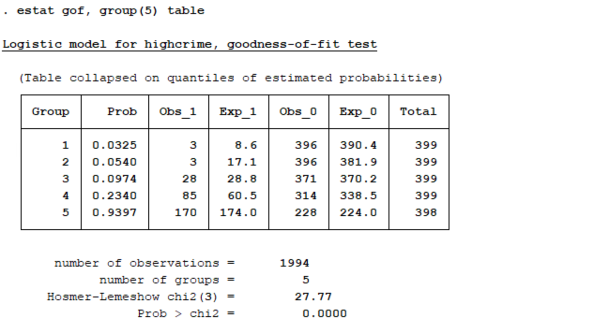

The purpose of our group is to compare the performance between Probit Regression and Logistic Regression in ¡°Communities and Crime Data Set¡± with Stata, R and Python. 

<font size="4">Introduction to Probit Regression and Logistic Regression</font><br /> 

Probit and Logistic model are both used to model dichotomous or binary outcome variables. The cumulative distribution function of the logistic distribution is modeled as a linear combination of the predictors in probit model. The logit model uses the cumulative distribution function of the logistic distribution. Both functions will take any number and rescale it to fall between 0 and 1. 

Both methods will yield similar (though not identical) inferences. Logistic model is more popular in health sciences like epidemiology partly because coefficients can be interpreted in terms of odds ratios. Probit model can be generalized to account for non-constant error variances in more advanced econometric settings (known as heteroskedastic probit models) and hence are used in some contexts by economists and political scientists. 


<font size="4">Data we used here</font><br /> 

The dataset we used is ¡°Communities and Crime Data Set¡± from UCI Machine Learning Repository. The data combines socio-economic data from the 1990 US Census, law enforcement data from the 1990 US LEMAS survey, and crime data from the 1995 FBI UCR.

We chose ViolentCrimesPerPop as response variable and Population, perCapInc, PctPopUnderPov, pctUrban as predictor variables. Our task is to figure out what is more likely to cause high violent crime rate based on their personal information. The probit and logistic regression are carried out to handle this challenge.


```{r, echo=FALSE,message=FALSE}
library(aod)
library(ggplot2)
library(dplyr)
library(ResourceSelection)
library(tidyverse)
```
<font size="5"> Python Part</font><br />

<font size="5"> R Part</font><br />

<font size="4"> 1) Loading and training data</font><br />

We selected the "Population, perCapInc, PctPopUnderPov, pctUrban" as predictor variables and deleted the missing value.

```{r}
communities.data <- read.csv("~/communities.data.txt", header=FALSE)
df3<-select(communities.data,c(6,17,26,34,128))
df3<-na.omit(df3)
a=rep(0,1994)
for(i in 1:1994){
  if(df3$V128[i]>0.5){
    a[i]=1
  }
}
df3<-cbind(df3,a)
head(df3)
```

<font size="4"> 2) Probit model</font><br />

The code below estimates a probit regression model using the glm (generalized linear model) function.

```{r}
myprobit <- glm(a ~ V6 + V17 + V26 +V34, family = binomial(link = "probit"), data = df3)
summary(myprobit)
```

The deviance residuals are a measure of model fit. This part of output shows the distribution of the deviance residuals for individual cases used in the model. The next part of the output shows the coefficients, their standard errors, the z-statistic and the associated p-values.

From the result we can see that "Population, PctPopUnderPov, pctUrban" are statistically significant while "perCapInc" doesn't have good performance. 

Below the table of coefficients are fit indices, including the null and deviance residuals and the AIC. Later we show an example of how you can use these values to help assess model fit. In addition, we can obtain confidence intervals for the coefficient estimates that is based on the standard error and the normal assumption.

```{r}
confint(myprobit)
```

We can test for an overall effect of "Population, PctPopUnderPov, pctUrban, perCapInc" using the wald.test function.

```{r}
wald.test(b = coef(myprobit), Sigma = vcov(myprobit), Terms = 2:5)
```

The chi-squared test statistic of 322.7 with 4 degrees of freedom is associated with a p-value of less than 0.001 indicating that the overall effect of rank is statistically significant. Then we use testing data set and predicted probabilities to help us understand the model. 

```{r}
df3[, c("p", "se")] <- predict(myprobit, df3, type = "response", se.fit = TRUE)[-3]
with(myprobit, pchisq(null.deviance - deviance, df.null - df.residual, lower.tail = FALSE))
```

We can also see measures of how well our model fits. The chi-square of 305.8052 with 3 degrees of freedom and an associated p-value of less than 0.001 tells us that our model as a whole fits significantly better than an empty model.

Then we took the Hosmer-Lemeshow test to compare the result of probit model with logistic model. 

```{r}
hoslem.test(myprobit$y, fitted(myprobit), g=5)
```

The group number is set as 5 because this will be easy to compare the results with other language. The p-value tells us that our model is a good fit. 

<font size="4"> 3) Logistic model</font><br />

Just like the probit regression, the code below estimates a probit regression model using the glm (generalized linear model) function.

```{r}
mylogit <- glm(a ~ V6 + V17 + V26 +V34, data = df3, family = "binomial")
summary(mylogit)
confint.default(mylogit)
```

We can see that Logistic model has similar result as the Probit model. All the predictors are statistically significant except for perCapInc. (The p-value for perCapInc in Logistic model is lower than in Probit model)

```{r}
wald.test(b = coef(mylogit), Sigma = vcov(mylogit), Terms = 2:5)
```

The chi-squared test statistic of 285.1 ( a little bit lower than the one in probit regression) with 4 degrees of freedom is associated with a p-value of less than 0.001 indicating that the overall effect of rank is statistically significant. 

```{r}
 hoslem.test(mylogit$y, fitted(mylogit), g=5)
```

From the H-L test in Logistic model, we can see that the Logistic model also has a good fit. 

<font size="5"> STATA Part</font><br />

In this example, the models will be evaluated using Pseudo $R^2$, Wald tests, Pearson's test and the Hosmer-Lemeshow test. All three are more easily available in Stata than they are in R or python, so we thought it was worth while to explore all of them briefly below. 

Below is the code to import the data set to Stata. The data loaded is a subset of the original data that only includes the relevant columns. 

``{r, eval=FALSE}
clear
import delimited CommunitiesCrimeData.csv
``

First, we run a probit regression with the data. The syntax for this command is to give the dependent variable followed by any independent variables. If, in and weight options are also avaible, but we didn't use them in this example.

``{r, eval=FALSE}
probit highcrime percapinc pctpopunderpov pcturban population
``


Here is the output for the probit regression. One measure of goodness of fit that can be accessed at this point is Pseudo $R^2$ which is 0.2487 for this model.  Pseudo $R^2$ is used for probit regression because the typical OLS $R^2$ does not apply. This measure should be used cautiously because it is difficult to interpret and does not represent the proportion of the variance explained by the independent variables like the OLS $R^2$.

The coefficients for the probit model can be interpreted as the difference in Z score associated with each one-unit difference in the predictor variable. Three of the four coefficients are significant according to a wald test. The coefficient for per capita income is close to significant but not quite there.

We can access more information on goodness of fit by using a postestimation command that depends on the most recent model.  The command is gof for goodness of fit.

``{r, eval=FALSE}
estat gof
``


This command performs a Pearson's goodness of fit test. The p-value for this test (the Prob > chi2 line) is 1, so we fail to reject the null that the model is a good fit.

We can also perform a Hosmer-Lemeshow test for goodness of fit. The code is very similar to the code for the Pearson test, but we specify the number of groups. Adding table to the command tells Stata to make the table of observation counts for the different groups.

``{r, eval = FALSE}
estat gof, group(5) table
``


Typically, the Hosmer-Lemeshow specifies 10 groups. However, in the case when there are small group counts, it is recommended that we choose a smaller number of groups.
Here we've reduced the number of groups here to 5. Even with the reduced number of groups, the first two groups still have low counts of high crime communities. These low group counts mean that the results of this test are unreliable.

The p-value for this test is > 0.001, which tells us to reject the null hypothesis that the model is a good fit. This contradicts the conclusion we came to with Pearson's test. We showed above that this test may not be reliable, so we should trust the Pearson's test results instead of these results.


Next we run a logistic regression. The syntax for this command is the same as for the probit command. 


``{r, eval=FALSE}
logistic highcrime percapinc pctpopunderpov pcturban population
``


Here is the output for the logistic regression. Again, Pseudo $R^2$ is available. For this model it is 0.2402.  Similar to probit regression, Pseudo $R^2$ is used for probit regression because the typical OLS $R^2$ does not apply.

The coefficients are given as odds ratios. Exponentiating those quantities will give us information on the relationship between the independent variables and the odds of being a highcrime community. According to wald tests for significance, all four independent variables are significant. 

We can access more information on goodness of fit by using a postestimation command that depends on the most recent model.

``{r, eval=FALSE}
estat gof
``


This command performs a Pearson's goodness of fit test. The p-value for this test (the Prob > chi2 line) is 1, so we fail to reject the null that the model is a good fit. 

We can also perform a Hosmer-Lemeshow test for goodness of fit. 

``{r, eval = FALSE}
estat gof, group(5) table
``



Similarly to the probit case, we've reduced the number of groups here to 5. Even with the reduced number of groups, the first two groups still have low counts of high crime communities. The low group counts mean that the results of this test are unreliable.

The p-value for this test is > 0.001, which tells us to reject the null hypothesis that the model is a good fit. However, this contradicts the conclusion we came to with Pearson's test, and because we established that this test may not be reliable, we should trust the Pearson's test results. 


Overall, the logistic and probit models perform similarly. The psuedo $R^2$ is slightly higher for the probit model in this situation. Three of the four predictors are significant in the probit model, while all four are significant in the logistic model. This difference my lead to slightly different final models if we were using these models as intermediate steps in our model building process.
Both models have good fit according the Pearson's goodness of fit test. Both models were poor fitting according to the Hosmer-Lemeshow test, but this test is likely to be unreliable due to low group counts. The major difference is the link function and not performance.

<font size="5"> Conclusion</font><br />

In all three examples, you can see that logistic and probit regression performed similarly. Running the models and doing the diagnostic tests was relatively easy and short in both Stata and R. However, it was inconvient in python because sklearn package doesn't include functions for the tests. It is necessary to code the tests from scratch. This may influence your language choice if you are running similar analysis.

Your choice of link function may depend on the audience you will present to. Logistic models are common in biological and epidemiological settings because odds ratios are common in those settings. Probit models more often arise in econometric or political science settings. 

<font size="5"> Reference</font><br />

Stata logistic documentation: https://www.stata.com/manuals13/rlogistic.pdf    
UCLA Stata logistic regression: https://stats.idre.ucla.edu/stata/output/logistic-regression-analysis/    
Stata estat gof documentation: https://www.stata.com/manuals13/restatgof.pdf     
Stata probit documentation: https://www.stata.com/manuals13/rprobit.pdf   
UCLA Stata probit regression: https://stats.idre.ucla.edu/stata/dae/probit-regression/    
The Analysis Factor: https://www.theanalysisfactor.com/the-difference-between-logistic-and-probit-regression/ 
UCLA R logistic regression: https://stats.idre.ucla.edu/r/dae/logit-regression/
UCLA R Probit regression: https://stats.idre.ucla.edu/r/dae/probit-regression/
Methods: What is the difference between logit and probit model: https://www.methodsconsultants.com/tutorial/what-is-the-difference-between-logit-and-probit-models/
Wiki Probit regression: https://en.wikipedia.org/wiki/Probit_model
Wiki Logistic regression: https://en.wikipedia.org/wiki/Logistic_regression


