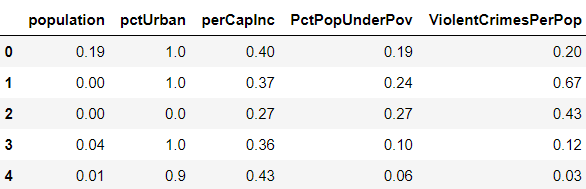
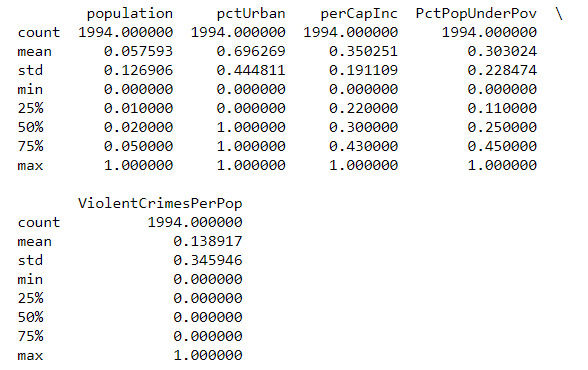
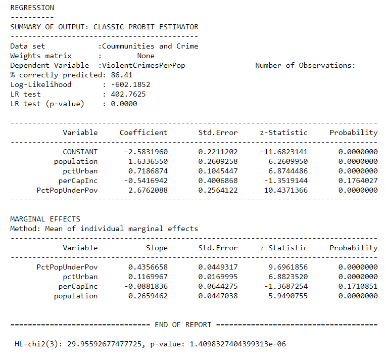
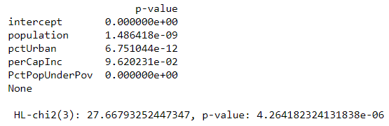

```{r setup, include=FALSE}
knitr::opts_chunk$set(echo = TRUE)
```


## Library needed
```{r, eval=FALSE}
import numpy as np
import pandas as pd
from sklearn.linear_model import LogisticRegression
import pysal
from scipy.stats import chi2, norm
```

## Load and clean the data
Before implenting the models, we first load the data in our working directory. Having noticed that this dataset used '?' as missing values, we repalce it with np.nan so that the missing values can be figured out by Python. And then we select the indepent variables we need which are 'population' (col6), 'pctUrban' (col17), 'perCapInc' (col26), 'PctPopUnderPov' (col34) and dependent variable 'ViolentCrimesPerPop' (col128). And then we drop all the lines that include missing values. And the top 5 lines of the dataset are shown below.

```{r, eval=FALSE}
with open('communities.data','rb') as f:
        file_content = list(item.decode() for item in f)
        
raw_data = []
for item in file_content:
    item_rp = item.rstrip('\r\n')
    item_sp = item_rp.split(',')
    raw_data.append(item_sp)

col_names = range(128)
f = pd.read_csv('communities.data', header = None)
raw_data = f.replace('?', np.nan)

mydata = raw_data.iloc[:,[6-1, 17-1, 26-1, 34-1, 128-1]]
mydata.columns = ['population', 'pctUrban', 
                  'perCapInc', 'PctPopUnderPov',
                  'ViolentCrimesPerPop']
data = mydata.dropna()
data.head()
```




## Recode the data
As this tutorial mainly focus on the binary outcome variable, we create a cut-off point for the dependent variable to transform it from continuous to binary. We set the value of *ViolentCrimesPerPop* (total number of violent crimes per 100K popuation) to be 1 when it is larger than 0.5 and to be 0 when it is smaller than 0.5. The following table is the summary of the recoded data. We can see that the data is standardized --- the range of each variables are [0, 1].

```{r, eval=FALSE}
data['ViolentCrimesPerPop'][ data['ViolentCrimesPerPop'] > 0.5 ] = 1
data['ViolentCrimesPerPop'][ data['ViolentCrimesPerPop'] <= 0.5 ] = 0
print(data.describe())

X = data.iloc[:,:4].values
Y = data.iloc[:, 4].values[:, None]
```





## Define some functions for future models
### Function for HL-test
We will apply Hosmer-Lemeshow test to compare the goodness of fit in probit and logit model. However, Python doesn't have any package for this test, So, we define the HL test function based on its concept and output the chisquared statitic and p-value for it.

```{r, eval=FALSE}
def hl_test(data, g):
    '''
    Hosmer-Lemeshow test to judge the goodness of fit for binary data

    Input: dataframe(data), integer(num of subgroups divided)
    
    Output: float
    '''
    data_st = data.sort_values('prob')
    data_st['dcl'] = pd.qcut(data_st['prob'], g)
    
    ys = data_st['ViolentCrimesPerPop'].groupby(data_st.dcl).sum()
    yt = data_st['ViolentCrimesPerPop'].groupby(data_st.dcl).count()
    yn = yt - ys
    
    yps = data_st['prob'].groupby(data_st.dcl).sum()
    ypt = data_st['prob'].groupby(data_st.dcl).count()
    ypn = ypt - yps
    
    hltest = ( ((ys - yps)**2 / yps) + ((yn - ypn)**2 / ypn) ).sum()
    pval = 1 - chi2.cdf(hltest, g-2)
    
    df = g-2
    
    print('\n HL-chi2({}): {}, p-value: {}\n'.format(df, hltest, pval))
```


## Function for p-values
Due to the lack of the function for outputting the significance of each variables in sklearn logistic packages, we write a function to print out p-values for each independent variables in logistic model used in sklearn.

```{r, eval=FALSE}
def logit_p(skm, x):
    '''
     Print the p-value for sklearn logit model

    Input: model, nparray(df of independent variables)
    
    Output: none
    '''
    pb = skm.predict_proba(x)
    n = len(pb)
    m = len(skm.coef_[0]) + 1
    coefs = np.concatenate([skm.intercept_, skm.coef_[0]])
    x_full = np.matrix(np.insert(np.array(x), 0, 1, axis = 1))
    result = np.zeros((m, m))
    for i in range(n):
        result = result + np.dot(np.transpose(x_full[i, :]), 
                                 x_full[i, :]) * pb[i,1] * pb[i, 0]
    vcov = np.linalg.inv(np.matrix(result))
    se = np.sqrt(np.diag(vcov))
    t =  coefs/se  
    pval = (1 - norm.cdf(abs(t))) * 2
    print(pd.DataFrame(pval, 
                       index=['intercept','population','pctUrban', 
                              'perCapInc', 'PctPopUnderPov'], 
                       columns=['p-value']))
```


## Fit the model
Now we can fit our different models for the manipulated dataset and apply the HL test.

### Probit model
```{r, eval=FALSE}
pbt = pysal.spreg.Probit(Y, X, 
                         name_x=['population', 'pctUrban', 
                                 'perCapInc', 'PctPopUnderPov'], 
                         name_y='ViolentCrimesPerPop', 
                         name_ds='Coummunities and Crime')
data['prob'] = pbt.predy
print(pbt.summary)
p_probit = hl_test(data, 5)
```



From the summary of the probit model above, we can see that *perCapInc* variable is insignificant, while other 3 variables are significant. According to the meaning of these varibales, the population for community, percentage of people living in areas and the percentage of people under the poverty level do have enough influence on the crime rate in communities, while the income of people doesn't have significant influence on the crime rate. And according to the HL test, we can see that the probit model fit the data quite well.


### Logit model
```{r, eval=FALSE}
lr = LogisticRegression(C=1000.0, random_state=0)
lr.fit(X, Y)
data['prob'] = lr.predict_proba(X)[:, 1]
print(logit_p(lr, X))
p_logit = hl_test(data, 5)
```



From the summary of logit model, we can also see that except variable *perCapInc*, other 3 variables are significant. And compared the result of HL test in logit model with the probit model, we can see that there is slight difference. Thus, the logit model fits the dataset as good as probit models does.
