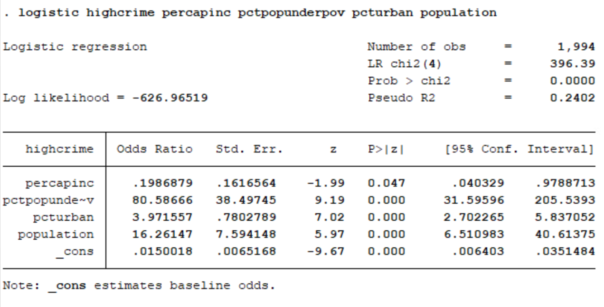

###Libraries

```{r}
library(tidyverse)
```


###Data

```{r}
data = read.csv("~/Documents/Stats506/communities.csv", header = FALSE)
```


###Data Cleaning

```{r}
clean_data = data %>%
  select(V6,V26,V34,V17,V128)

colnames(clean_data) = c("population","perCapInc","PctPopUnderPov",
                         'pctUrban',"ViolentCrimesPerPop")

clean_data = clean_data %>%
  mutate(HighCrime = ifelse(ViolentCrimesPerPop >= 0.5,1,0))%>%
  select(-ViolentCrimesPerPop)
```

###export clean data

```{r}
write.csv(clean_data,file = "CommunitiesCrimeData.csv")
```


#Put following in full doc

Below is the code to import the data set to STATA. The data loaded is a subset of the original data that only includes the relevant columns. 

```{r, eval=FALSE}
clear
import delimited CommunitiesCrimeData.csv
```


First, we run a logistic regression with the data. The syntax for this command is to give the dependent variable followed by any independent variables. If, in and weight options are also avaible, but we didn't use them in this example.


```{r, eval=FALSE}
logistic highcrime percapinc pctpopunderpov pcturban population
```




Here is the output for the logistic regression. One measure of goodness of fit that can be accessed at this point is Pseudo $R^2$ which is 0.2402 for this model.  Pseudo $R^2$ is used for logistic regression because the typical OLS $R^2$ does not apply. This measure should be used cautiously because it is difficult to interpret and does not represent the proportion of the variance explained by the independent variables like the OLS $R^2$. 

The coefficients are given as odds ratios. Exponentiating those quantities will give us information on the relationship between the independent variables and the odds of being a highcrime community.

We can access more information on goodness of fit by using a postestimation command that depends on the most recent model. The command is gof for goodness of fit.

```{r, eval=FALSE}
estat gof
```


This command performs a Pearson's goodness of fit test. The p-value for this test (the Prob > chi2 line) is 1, so we fail to reject the null that the model is a good fit. 


Next we run a probit regression. The syntax for this command is the same as for the logistic command. 

```{r, eval=FALSE}
probit highcrime percapinc pctpopunderpov pcturban population
```


Here is the output for the probit regression. Again, Pseudo $R^2$ is available. For this model it is 0.2487.  Similar to logistic regression, Pseudo $R^2$ is used for probit regression because the typical OLS $R^2$ does not apply. 

The coefficients for the probit model can be interpreted as the difference in Z score associated with each one-unit difference in the predictor variable.


Again, we can access more information on goodness of fit by using a postestimation command that depends on the most recent model. The command is the same as for the logistic model.

```{r, eval=FALSE}
estat gof
```


This command performs a Pearson's goodness of fit test. The p-value for this test (the Prob > chi2 line) is 1, so we fail to reject the null that the model is a good fit.

The logistic and probit models performed similarly. The psuedo $R^2$ is slightly higher for the probit model in this situation. They are both good fitting models according the Pearson's goodness of fit test. The major difference is the link function and not performance.


###Conclusion

In all three examples, you can see that logistic and probit regression performed similarly. 

Your choice of model may depend on the audience you will present to. Logistic models are common in biological and epidemiological settings because odds ratios are common in those settings. Probit models more often arise in econometric or political science settings. 


###References

Stata logistic documentation: https://www.stata.com/manuals13/rlogistic.pdf  
UCLA Stata logistic regression: https://stats.idre.ucla.edu/stata/output/logistic-regression-analysis/  
Stata estat gof documentation: https://www.stata.com/manuals13/restatgof.pdf   
Stata probit documentation: https://www.stata.com/manuals13/rprobit.pdf  
UCLA Stata probit regression: https://stats.idre.ucla.edu/stata/dae/probit-regression/  
The Analysis Factor: https://www.theanalysisfactor.com/the-difference-between-logistic-and-probit-regression/  


